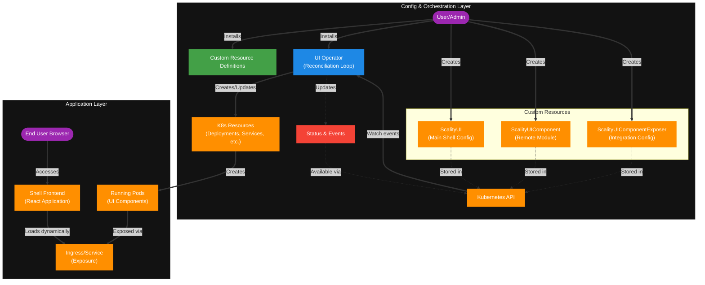

# UI Operator

A Kubernetes operator for managing micro-frontend applications and UI components in a declarative way.

[](https://goreportcard.com/report/github.com/ui-operator/ui-operator)
[](https://opensource.org/licenses/Apache-2.0)

## Overview

The UI Operator enables organizations to deploy and manage complex web applications built with micro-frontend architecture. It provides a declarative approach to:

- **Deploy UI applications**: Manage main UI shell applications that host micro-frontends
- **Orchestrate UI components**: Deploy and configure individual micro-frontend components
- **Configure runtime exposure**: Set up routing, authentication, and runtime configuration for components
- **Handle dependencies**: Automatically manage relationships between UI applications and their components

### Architecture

The operator manages three Custom Resource Definitions (CRDs):

- **`ScalityUI`** (cluster-scoped): Defines the main UI application with global configuration
- **`ScalityUIComponent`** (namespaced): Represents individual micro-frontend components
- **`ScalityUIComponentExposer`** (namespaced): Configures how components are exposed and integrated

> **Note:** The architecture diagram below uses Mermaid syntax which may not render in all Markdown viewers. A static image version is available [here](https://github.com/scality/ui-operator/blob/main/docs/images/architecture.png).



## Table of Contents

- [Quick Start](#quick-start)
- [Installation](#installation)
- [Basic Usage](#basic-usage)
- [Configuration](#configuration)
- [API Reference](#api-reference)
- [Features](#features)
- [Examples](#examples)
- [Operations](#operations)
- [Development](#development)

## Quick Start

### Prerequisites

- Kubernetes cluster v1.11.3+
- kubectl v1.11.3+
- Cluster admin permissions

### Installation

1. **Install the operator:**

   ```bash
   # Using latest stable release (recommended for production)
   kubectl apply -f https://raw.githubusercontent.com/ui-operator/ui-operator/0.1.0/dist/install.yaml

   # Using specific version
   kubectl apply -f https://raw.githubusercontent.com/ui-operator/ui-operator/{version}/dist/install.yaml

   # Using main branch (not recommended for production)
   kubectl apply -f https://raw.githubusercontent.com/ui-operator/ui-operator/main/dist/install.yaml
   ```

2. **Verify installation:**

   ```bash
   kubectl get pods -n ui-operator-system
   ```

3. **Check CRDs are installed:**
   ```bash
   kubectl get crd | grep ui.scality.com
   ```

### Basic Usage

1. **Create a UI application:**

   ```yaml
   apiVersion: ui.scality.com/v1alpha1
   kind: ScalityUI
   metadata:
     name: my-ui-app
   spec:
     image: "my-registry/ui-shell:v1.0.0"
     productName: "My Application"
   ```

2. **Deploy a UI component:**

   ```yaml
   apiVersion: ui.scality.com/v1alpha1
   kind: ScalityUIComponent
   metadata:
     name: dashboard-component
     namespace: my-app
   spec:
     image: "my-registry/dashboard:v1.0.0"
     mountPath: "/app/config"
   ```

3. **Expose the component:**
   ```yaml
   apiVersion: ui.scality.com/v1alpha1
   kind: ScalityUIComponentExposer
   metadata:
     name: dashboard-exposer
     namespace: my-app
   spec:
     scalityUI: "my-ui-app"
     scalityUIComponent: "dashboard-component"
     appHistoryBasePath: "/dashboard"
   ```

## Installation

### Method 1: Using Pre-built Manifests (Recommended)

```bash
# Using latest stable release (recommended for production)
kubectl apply -f https://raw.githubusercontent.com/ui-operator/ui-operator/0.1.0/dist/install.yaml

# Using specific version
kubectl apply -f https://raw.githubusercontent.com/ui-operator/ui-operator/{version}/dist/install.yaml

# Using main branch (not recommended for production)
kubectl apply -f https://raw.githubusercontent.com/ui-operator/ui-operator/main/dist/install.yaml
```

### Method 2: Using Kustomize

1. **Clone the repository:**

   ```bash
   git clone https://github.com/ui-operator/ui-operator.git
   cd ui-operator
   ```

2. **Install CRDs:**

   ```bash
   make install
   ```

3. **Deploy the operator:**
   ```bash
   make deploy IMG=ui-operator/ui-operator:latest
   ```

### Method 3: Building from Source

1. **Build and push the operator image:**

   ```bash
   make docker-build docker-push IMG=<your-registry>/ui-operator:tag
   ```

2. **Deploy with your custom image:**
   ```bash
   make deploy IMG=<your-registry>/ui-operator:tag
   ```

### Verification

Check that the operator is running:

```bash
# Check operator pod
kubectl get pods -n ui-operator-system

# Check CRDs
kubectl get crd | grep ui.scality.com

# Check operator logs
kubectl logs -n ui-operator-system deployment/ui-operator-controller-manager
```

## Configuration

### ScalityUI Resource

The `ScalityUI` resource defines the main UI application:

```yaml
apiVersion: ui.scality.com/v1alpha1
kind: ScalityUI
metadata:
  name: my-shell-ui-app
spec:
  image: "my-registry/ui-shell:v1.0.0"
  productName: "My Application"
  themes:
    light:
      type: "core-ui"
      name: "light-theme"
      logo:
        type: "path"
        value: "/assets/logo.png"
  navbar:
    main:
      - internal:
          kind: "navigation"
          view: "dashboard"
          icon: "dashboard"
          label:
            en: "Dashboard"
  networks:
    ingressClassName: "nginx"
    host: "my-app.example.com"
    tls:
      - secretName: "ui-tls"
        hosts:
          - "my-app.example.com"
  auth:
    kind: "OIDC"
    providerUrl: "https://auth.example.com"
    clientId: "my-ui-app"
    scopes: "openid email profile"
```

### ScalityUIComponent Resource

The `ScalityUIComponent` resource defines individual micro-frontend components:

```yaml
apiVersion: ui.scality.com/v1alpha1
kind: ScalityUIComponent
metadata:
  name: monitoring-component
  namespace: ui
spec:
  image: "my-registry/monitoring-ui:v1.2.0"
  mountPath: "/app/configs"
  imagePullSecrets:
    - name: registry-secret
```

### ScalityUIComponentExposer Resource

The `ScalityUIComponentExposer` resource configures how components are exposed:

```yaml
apiVersion: ui.scality.com/v1alpha1
kind: ScalityUIComponentExposer
metadata:
  name: monitoring-exposer
  namespace: ui
spec:
  scalityUI: "my-shell-ui-app"
  scalityUIComponent: "monitoring-component"
  appHistoryBasePath: "/monitoring"
  selfConfiguration:
    apiEndpoint: "https://api.example.com/monitoring"
    features:
      - "metrics"
      - "alerts"
```

## API Reference

### ScalityUI Fields

| Field              | Type   | Required | Description                               |
| ------------------ | ------ | -------- | ----------------------------------------- |
| `image`            | string | Yes      | Container image for the main UI shell     |
| `productName`      | string | Yes      | Product name displayed in the UI          |
| `themes`           | object | No       | Light and dark theme configurations       |
| `navbar`           | object | No       | Navigation bar configuration              |
| `networks`         | object | No       | Networking and ingress configuration      |
| `auth`             | object | No       | Default authentication configuration      |
| `imagePullSecrets` | array  | No       | Image pull secrets for private registries |

### ScalityUIComponent Fields

| Field              | Type   | Required | Description                                |
| ------------------ | ------ | -------- | ------------------------------------------ |
| `image`            | string | Yes      | Container image for the UI component       |
| `mountPath`        | string | Yes      | Path where configuration files are mounted |
| `imagePullSecrets` | array  | No       | Image pull secrets for private registries  |

### ScalityUIComponentExposer Fields

| Field                | Type   | Required | Description                              |
| -------------------- | ------ | -------- | ---------------------------------------- |
| `scalityUI`          | string | Yes      | Reference to ScalityUI resource          |
| `scalityUIComponent` | string | Yes      | Reference to ScalityUIComponent resource |
| `appHistoryBasePath` | string | Yes      | Base path for the component in the URL   |
| `selfConfiguration`  | object | No       | Runtime configuration for the component  |

## Features

### ✅ Core Features

- [x] **Micro-frontend Management**: Deploy and manage multiple UI components
- [x] **Runtime Configuration**: Dynamic configuration injection for components
- [x] **Authentication Integration**: OIDC and other auth providers
- [x] **Ingress Management**: Automatic routing and exposure
- [x] **Dependency Management**: Automatic relationship handling
- [x] **Rolling Updates**: Zero-downtime updates for components

## Examples

### Basic Setup

```yaml
# UI Application
apiVersion: ui.scality.com/v1alpha1
kind: ScalityUI
metadata:
  name: basic-ui
spec:
  image: "nginx:latest"
  productName: "Basic App"

---
# UI Component
apiVersion: ui.scality.com/v1alpha1
kind: ScalityUIComponent
metadata:
  name: hello-component
  namespace: default
spec:
  image: "nginx:latest"
  mountPath: "/app/config"

---
# Component Exposer
apiVersion: ui.scality.com/v1alpha1
kind: ScalityUIComponentExposer
metadata:
  name: hello-exposer
  namespace: default
spec:
  scalityUI: "basic-ui"
  scalityUIComponent: "hello-component"
  appHistoryBasePath: "/hello"
```

### With Authentication

```yaml
apiVersion: ui.scality.com/v1alpha1
kind: ScalityUI
metadata:
  name: secure-ui
spec:
  image: "my-registry/ui-shell:v1.0.0"
  productName: "Secure Application"
  auth:
    kind: "OIDC"
    providerUrl: "https://auth.example.com"
    clientId: "secure-ui"
    responseType: "code"
    scopes: "openid email profile"
    providerLogout: true
```

### Multi-Component Setup

```yaml
# Multiple components with different configurations
apiVersion: ui.scality.com/v1alpha1
kind: ScalityUIComponentExposer
metadata:
  name: dashboard-exposer
  namespace: default
spec:
  scalityUI: "main-ui"
  scalityUIComponent: "dashboard-component"
  appHistoryBasePath: "/dashboard"
  selfConfiguration:
    theme: "dark"
    refreshInterval: 30

---
apiVersion: ui.scality.com/v1alpha1
kind: ScalityUIComponentExposer
metadata:
  name: settings-exposer
  namespace: default
spec:
  scalityUI: "main-ui"
  scalityUIComponent: "settings-component"
  appHistoryBasePath: "/settings"
```

## Operations

### Monitoring

The operator exposes Prometheus metrics at `/metrics`:

```yaml
# ServiceMonitor for Prometheus
apiVersion: monitoring.coreos.com/v1
kind: ServiceMonitor
metadata:
  name: ui-operator-metrics
spec:
  selector:
    matchLabels:
      app.kubernetes.io/name: ui-operator
  endpoints:
    - port: metrics
      interval: 30s
      path: /metrics
```

### Troubleshooting

#### Check Resource Status

```bash
# Check UI status
kubectl get scalityui my-ui-app -o yaml

# Check component status
kubectl describe scalityuicomponent my-component

# Check exposer status
kubectl get scalityuicomponentexposer my-exposer -o yaml
```

#### View Logs

```bash
# Operator logs
kubectl logs -n ui-operator-system deployment/ui-operator-controller-manager

# Component logs
kubectl logs deployment/my-component
```

#### Common Issues

1. **Component not starting**: Check image pull secrets and registry access
2. **Configuration not applied**: Verify exposer references correct UI and component
3. **Ingress not working**: Check ingress controller and network configuration

### Backup and Restore

```bash
# Backup all UI resources
kubectl get scalityui,scalityuicomponent,scalityuicomponentexposer -o yaml > ui-backup.yaml

# Restore resources
kubectl apply -f ui-backup.yaml
```

### Upgrading

```bash
# Update to latest stable release (recommended)
kubectl apply -f https://raw.githubusercontent.com/ui-operator/ui-operator/0.1.0/dist/install.yaml

# Update to specific version
kubectl apply -f https://raw.githubusercontent.com/ui-operator/ui-operator/{version}/dist/install.yaml

# Update using main branch (not recommended for production)
kubectl apply -f https://raw.githubusercontent.com/ui-operator/ui-operator/main/dist/install.yaml

# Check operator version
kubectl get deployment -n ui-operator-system ui-operator-controller-manager -o jsonpath='{.spec.template.spec.containers[0].image}'
```

### Uninstalling

```bash
# Delete all custom resources
kubectl delete scalityui --all
kubectl delete scalityuicomponent --all
kubectl delete scalityuicomponentexposer --all

# Remove operator (use the same version you installed)
kubectl delete -f https://raw.githubusercontent.com/ui-operator/ui-operator/0.1.0/dist/install.yaml

# Remove CRDs (optional)
kubectl delete crd scalityuis.ui.scality.com
kubectl delete crd scalityuicomponents.ui.scality.com
kubectl delete crd scalityuicomponentexposers.ui.scality.com
```

## Security & RBAC

The UI Operator leverages Kubernetes Role-Based Access Control (RBAC) to secure access to resources. When installed, the operator creates several roles and bindings to manage permissions.

### Roles Created by the Operator

The following roles are created during installation:

1. **Manager Role (ClusterRole)**:

   - Used by the operator to manage resources
   - Permissions to manage deployments, services, configmaps, ingresses, etc.
   - Full access to the CRDs it manages

2. **Editor Roles (ClusterRole)**:

   - `scalityui-editor-role`: For users who need to create/update/delete ScalityUI resources
   - `scalityuicomponent-editor-role`: For users who need to create/update/delete ScalityUIComponent resources
   - `scalityuicomponentexposer-editor-role`: For users who need to create/update/delete ScalityUIComponentExposer resources

3. **Viewer Roles (ClusterRole)**:

   - `scalityui-viewer-role`: For users who only need read access to ScalityUI resources
   - `scalityuicomponent-viewer-role`: For users who only need read access to ScalityUIComponent resources
   - `scalityuicomponentexposer-viewer-role`: For users who only need read access to ScalityUIComponentExposer resources

4. **Support Roles**:
   - `metrics-reader-role`: For accessing Prometheus metrics
   - `leader-election-role`: For the operator's leader election mechanism

### Required Permissions for Users

Different users require different levels of permissions:

#### Cluster Administrators

- Need permissions to install the operator and CRDs
- Required permissions: `cluster-admin` or equivalent

#### Application Operators

- Need permissions to create and manage ScalityUI resources (cluster-scoped)
- Required ClusterRoleBinding: `scalityui-editor-role`

#### Application Developers

- Need permissions to create and manage components in their namespaces
- Required RoleBindings in relevant namespaces:
  - `scalityuicomponent-editor-role`
  - `scalityuicomponentexposer-editor-role`

#### Read-only Users

- Need permissions to view but not modify resources
- Required RoleBindings: Viewer roles for respective resource types

### Assigning RBAC Permissions

To assign permissions to a user or group:

```yaml
# Example: Granting a user edit permissions for UI Components
apiVersion: rbac.authorization.k8s.io/v1
kind: RoleBinding
metadata:
  name: developer-ui-component-editor
  namespace: my-app-namespace
subjects:
  - kind: User
    name: developer@example.com
    apiGroup: rbac.authorization.k8s.io
roleRef:
  kind: ClusterRole
  name: scalityuicomponent-editor-role
  apiGroup: rbac.authorization.k8s.io
```

### Security Best Practices

1. **Follow Least Privilege Principle**:

   - Assign the minimum necessary permissions
   - Use viewer roles for users who only need read access

2. **Namespace Isolation**:

   - Create components and exposers in dedicated namespaces
   - Limit access to those namespaces with RoleBindings

3. **Audit Role Assignments**:

   - Regularly review who has access to create/modify resources
   - Use `kubectl auth can-i` to verify permissions

4. **Secure Access to the Main UI Resource**:
   - Since ScalityUI is cluster-scoped, carefully control who can create/modify them

## Development

### Building from Source

```bash
# Clone the repository
git clone https://github.com/ui-operator/ui-operator.git
cd ui-operator

# Build the operator
make build

# Run tests
make test

# Build Docker image
make docker-build IMG=<your-registry>/ui-operator:tag
```

### Running Locally

```bash
# Install CRDs
make install

# Run operator locally (outside cluster)
make run
```

### Testing

```bash
# Run unit tests
make test

# Run tests with coverage
make test-cover

# Run e2e tests
make test-e2e

# Run specific controller tests
go test ./internal/controller/scalityuicomponentexposer -v
```

### Project Structure

```
├── api/v1alpha1/           # CRD type definitions
├── internal/controller/    # Controller implementations
├── config/                 # Kubernetes manifests
├── examples/              # Example configurations
├── test/                  # Test files
└── Makefile              # Build targets
```
